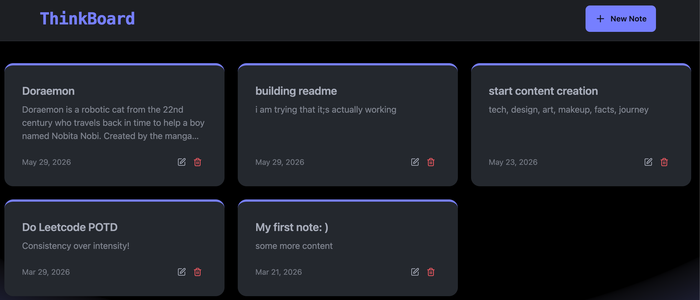

<div align="center">

<table>
<tr>
<td align="center" width="220">


</td>

<td align="left">

# ThinkBoard

### MERN Stack Note Management Application

🧠 Create, organize, and manage notes and ideas through a React frontend, Express REST API, MongoDB persistence, and Redis-powered rate limiting.

<br>


</td>
</tr>
</table>


<br><br>

</div>

---

## Preview

<p align="center">
  
</p>

---

## 🎬 Live Demo

The application is available at:

🔗 https://thinkboard-eqpi.onrender.com

---

## 💫 Overview

ThinkBoard is a MERN-stack note and idea management application designed for creating, storing, and organizing notes through a web interface.

The frontend is built with React and Vite, while the backend uses Express and MongoDB. Upstash Redis is integrated for request rate limiting. The repository follows a monorepo structure containing separate frontend and backend applications.

---

## 📚 Table of Contents

1. [Preview](#preview)
2. [🎬 Live Demo](#-live-demo)
3. [💫 Overview](#-overview)
4. [🎯 Features](#-features)
5. [🛠️ Technology Stack](#️-technology-stack)
6. [🖧 Architecture](#-architecture)
7. [📂 Repository Structure](#-repository-structure)
8. [🔍 Prerequisites](#-prerequisites)
9. [🧪 Installation](#-installation)
10. [🌲 Environment Configuration](#-environment-configuration)
11. [🚀 Running the Application](#-running-the-application)
12. [>_ Root Commands](#️-root-commands)
13. [</> Available Scripts](#-available-scripts)
14. [🤝 Contributing](#-contributing)
15. [📝 Issues](#-issues)
16. [🚨 Troubleshooting](#-troubleshooting)
17. [👑 Maintainer](#-maintainer)
18. [👥 Contributors](#-contributors)
19. [❤️ Project Support](#️-project-support)
20. [⚖️ License](#️-license)

---

## 🎯 Features

| Feature              | Description                           |
| -------------------- | ------------------------------------- |
| REST API             | Express-based backend API             |
| Database Persistence | MongoDB integration through Mongoose  |
| Rate Limiting        | Request limiting using Upstash Redis  |
| Routing              | Client-side routing with React Router |
| Notifications        | User feedback using React Hot Toast   |
| Styling              | Tailwind CSS and DaisyUI              |
| HTTP Client          | Axios-based API communication         |
| Development Tooling  | Vite, ESLint, and Nodemon             |

---

## 🛠️ Technology Stack

### Frontend

| Technology      | Purpose                  |
| --------------- | ------------------------ |
|  **React 19** | User Interface           |
|  **Vite** | Development & Build Tool |
|  **React Router** | Client-Side Routing      |
|  **Tailwind CSS** | Styling                  |
|  **DaisyUI** | UI Components            |
|  **Axios** | HTTP Client              |
|  **React Hot Toast** | Notifications            |
|  **Lucide React** | Icons                    |

### Backend

| Technology    | Purpose                       |
| ------------- | ----------------------------- |
|  **Node.js** | Runtime Environment           |
|  **Express.js** | REST API                      |
|  **MongoDB** | Database                      |
|  **Mongoose** | Object Data Modeling          |
|  **Upstash Redis** | Rate Limiting                 |
|  **Dotenv** | Environment Configuration     |
|  **CORS** | Cross-Origin Resource Sharing |
|  **Nodemon** | Development Server            |

---

## 🖧 Architecture

```text
┌─────────────────────────┐
│      React + Vite       │
│      Frontend SPA       │
└────────────┬────────────┘
             │ HTTP
             ▼
┌─────────────────────────┐
│       Express API       │
│      Backend Server     │
└───────┬────────┬────────┘
        │        │
        ▼        ▼
   MongoDB   Upstash Redis
   Storage   Rate Limiting
```

---

## 📂 Repository Structure

```text
ThinkBoard/
│
├── backend/
│   ├── src/
│   ├── package.json
│   └── package-lock.json
│
├── frontend/
│   ├── public/
│   ├── src/
│   ├── index.html
│   ├── vite.config.js
│   ├── tailwind.config.js
│   ├── postcss.config.js
│   ├── eslint.config.js
│   ├── package.json
│   └── package-lock.json
│
├── package.json
├── .gitignore
└── README.md
```

---

## 🧪 Prerequisites

Ensure the following software is installed before running the project:

* Node.js
* npm
* MongoDB
* Upstash Redis account

Verify installation:

```bash
node -v
npm -v
```

---

## 🚀 Installation

### Clone the Repository

```bash
git clone https://github.com/niharika-mente/ThinkBoard.git
cd ThinkBoard
```

### Install Backend Dependencies

```bash
cd backend
npm install
```

### Install Frontend Dependencies

```bash
cd ../frontend
npm install
```

---

## 🌲 Environment Configuration

Create a `.env` file inside the `backend` directory.

```env
MONGO_URI=your_mongodb_connection_string_here
PORT=5001

UPSTASH_REDIS_REST_URL=your_upstash_redis_url_here
UPSTASH_REDIS_REST_TOKEN=your_upstash_redis_token_here
```

### Environment Variables

| Variable                 | Description                        |
| ------------------------ | ---------------------------------- |
| PORT                     | Backend server port                |
| MONGO_URI                | MongoDB connection string          |
| UPSTASH_REDIS_REST_URL   | Upstash Redis REST endpoint        |
| UPSTASH_REDIS_REST_TOKEN | Upstash Redis authentication token |

---
### Frontend Environment Variables

No frontend environment variables are currently required.

### MongoDB Setup

ThinkBoard supports both local MongoDB instances and MongoDB Atlas.

#### Local MongoDB Example

```env
MONGO_URI=mongodb://localhost:27017/thinkboard
```

#### 🍃 MongoDB Atlas

1. Create a MongoDB Atlas cluster.
2. Create a database user.
3. Configure network access.
4. Copy the connection string from Atlas.
5. Replace `MONGO_URI` in your `.env` file with the Atlas connection string.

### 🔴 Upstash Redis Setup

Upstash Redis is used for API rate limiting.

1. Create an Upstash account.
2. Create a Redis database.
3. Open the database dashboard.
4. Copy:
   - `UPSTASH_REDIS_REST_URL`
   - `UPSTASH_REDIS_REST_TOKEN`
5. Add them to the `.env` file.

--- 

## 🚀 Running the Application

### Development

| Service  | Command                      |
| -------- | ---------------------------- |
| Backend  | `cd backend && npm run dev`  |
| Frontend | `cd frontend && npm run dev` |

Backend:

```text
http://localhost:5001
```

Frontend:

```text
http://localhost:5173
```

---

## >_ Root Commands

> **Note:** `npm start` launches only the backend server. The frontend must be started separately during development using `npm run dev` inside the `frontend` directory.

| Command         | Description                                 |
| --------------- | ------------------------------------------- |
| `npm run build` | Install dependencies and build the frontend |
| `npm start`     | Start the backend production server         |

---

## </> Available Scripts

### Backend

| Command       | Description              |
| ------------- | ------------------------ |
| `npm run dev` | Start development server |
| `npm start`   | Start production server  |

### Frontend

| Command           | Description                   |
| ----------------- | ----------------------------- |
| `npm run dev`     | Start Vite development server |
| `npm run build`   | Build application             |
| `npm run preview` | Preview production build      |
| `npm run lint`    | Run ESLint                    |

---

## 🤝 Contributing

Contributions are welcome and appreciated. Whether you're fixing bugs, improving documentation, enhancing the user interface, or proposing new features, your contributions help improve ThinkBoard.

### Contribution Workflow

```bash
# Fork the repository

# Clone your fork
git clone https://github.com/your-username/ThinkBoard.git

# Create a feature branch
git checkout -b feature/your-feature

# Commit changes
git commit -m "feat: add feature"

# Push changes
git push origin feature/your-feature
```

Open a Pull Request describing the changes and their purpose.

### 🏆 Good First Contributions

New contributors can help by:

- Improving documentation
- Reporting bugs
- Enhancing UI consistency
- Refactoring components
- Improving accessibility

### 📜 Contribution Guidelines

* Follow the existing project structure.
* Keep changes focused on a single concern.
* Test changes before submission.
* Update documentation when applicable.
* Use clear and descriptive commit messages.

---

## 📝 Issues

For bug reports or feature requests:

**1.** Search existing issues.
**2.** Open a new issue if necessary.
**3.** Provide reproduction steps.
**4.** Include relevant logs and environment details.

---

## 🚨 Troubleshooting

### MongoDB Connection Issues

* Verify MongoDB is running.
* Verify the connection string.
* Verify database access permissions.

### Redis Authentication Issues

* Verify Upstash credentials.
* Verify REST URL and REST token.
* Restart the backend server.

### Dependency Issues

```bash
rm -rf node_modules package-lock.json
npm install
```

---

## 👑 Maintainer

Maintained by **@niharika-mente**

---

## 👥 Contributors

Thanks to all the amazing people who contribute to **ThinkBoard** 🚀

<p align="center">
  <a href="https://github.com/niharika-mente/ThinkBoard/graphs/contributors">
    
  </a>
</p>

---

## ❤️ Project Support

<p align="center">
  <a href="https://github.com/niharika-mente/ThinkBoard/stargazers">
    
  </a>
  &nbsp;&nbsp;
  <a href="https://github.com/niharika-mente/ThinkBoard/network/members">
    
  </a>
</p>

---

## ⚖️ License

Distributed under the ISC License.

See the `LICENSE` file for details.

---

<div align="center">

### ⭐ Star the repository if you find it useful

Built with React, Express, MongoDB, and Upstash Redis.

</div>
